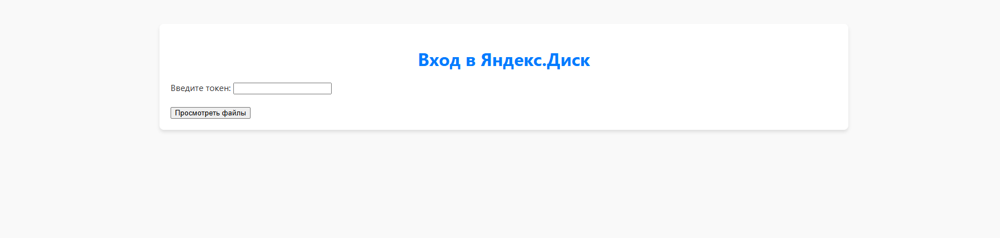
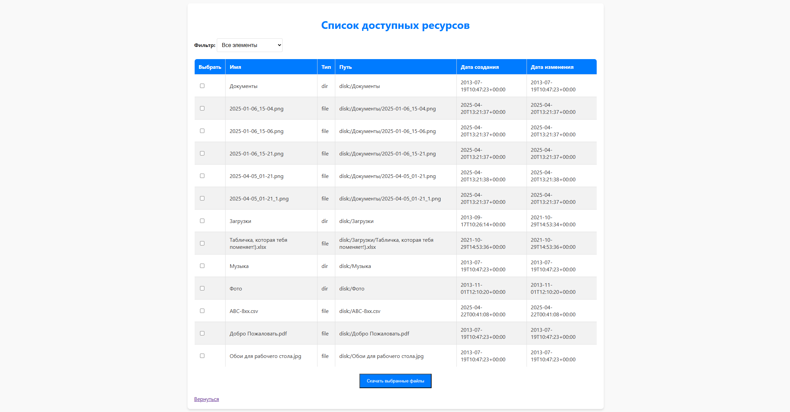

# 🌐 Django_YandexDisk_Client

Это веб-приложение на Django позволяет взаимодействовать с API Яндекс.Диска.

---

## 🚀 Возможности

1. **Просмотр файлов и папок**: После авторизации через токен пользователь может просматривать список всех файлов и папок, хранящихся на Яндекс.Диске.
2. **Скачивание файлов**: Пользователь может выбирать файлы из списка и скачивать их на локальный компьютер.
3. **Фильтрация файлов**: Реализована система фильтрации файлов по типам (например, только документы, только изображения).
4. **Кэширование данных**: Список файлов кэшируется для уменьшения количества запросов к API.

---

## 🛠 Установка

1. **Клонируйте репозиторий:**
```bash
git clone https://github.com/lazycat7777/Django_YandexDisk_Client.git
cd Django_YandexDisk_Client
```

2. **Создайте в корне проекта файл `.env`.**
Пример можно найти по пути `src\core\.env.example`

3. **Соберите и запустите приложение**:
```bash
docker-compose up -d --build
```

4. **В браузере откройте `http://localhost:8000/` и напишите токен.**

---

## 🖥 Веб-форма

### Главная страница


### Список файлов


---

## 📦 Технологии

- Python 3.11  
- Django  
- PostgreSQL  
- Docker / docker-compose
- Redis

---

## 📄 Лицензия

Проект распространяется под лицензией MIT. Свободен для использования и доработки.